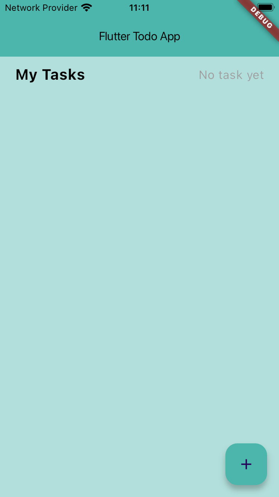
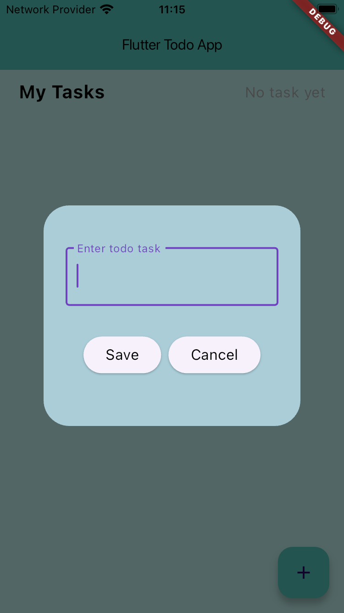
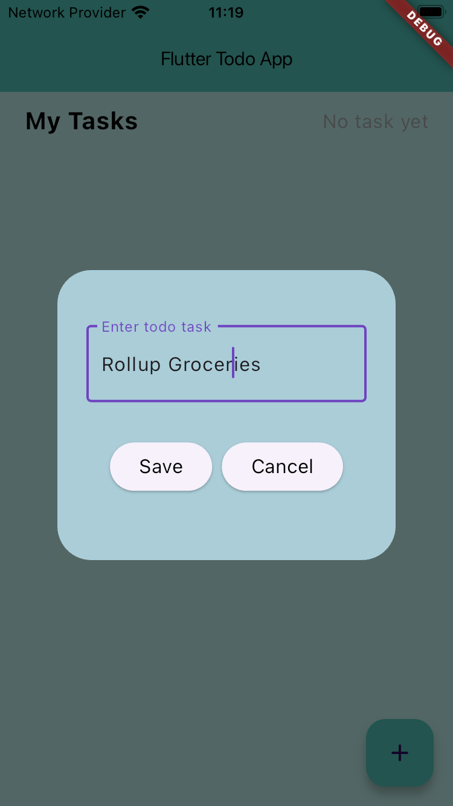
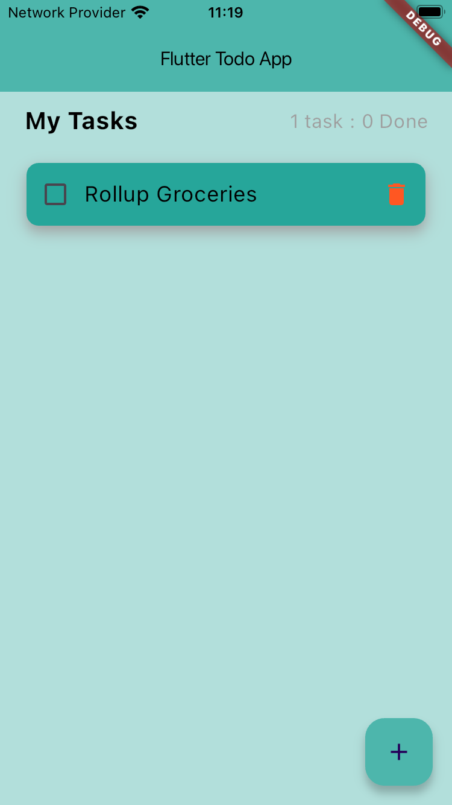
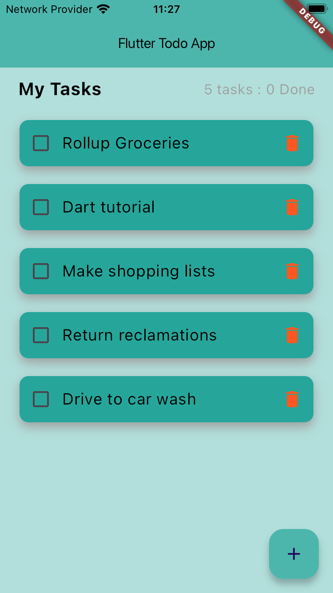
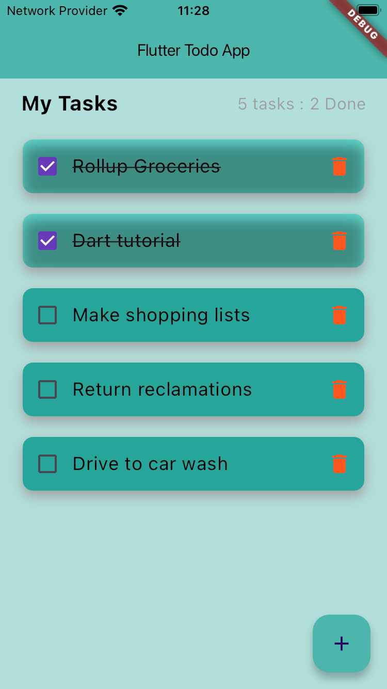
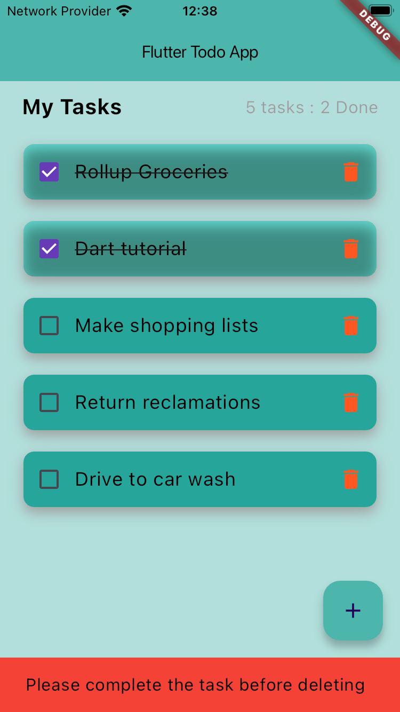
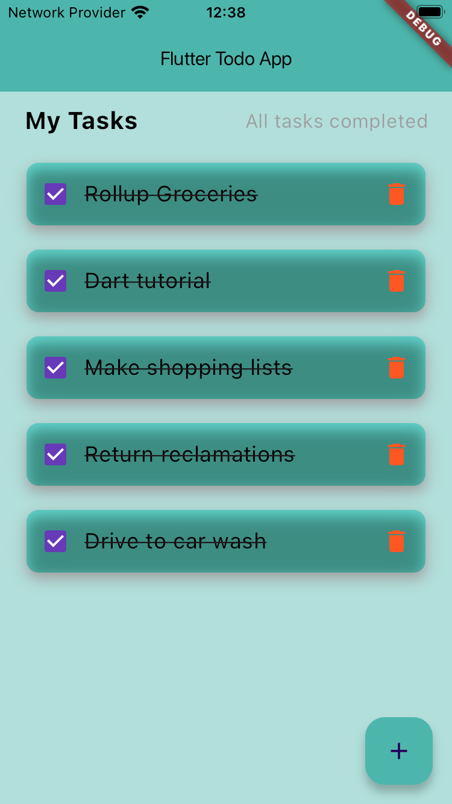

# A Small Todo App in Flutter

This is a small todo app in flutter. It is a simple app that allows you to add, delete and mark todos as done. It is a simple app that I made to learn flutter.

## Getting Started

To run this app, you need to have flutter installed on your machine. You can follow the instructions on the [official flutter website](https://flutter.dev/docs/get-started/install) to install flutter on your machine.

## Install the dependencies

```bash
flutter packages get
```

## Run the app

```bash
flutter run
```

## Screenshots










<br >
